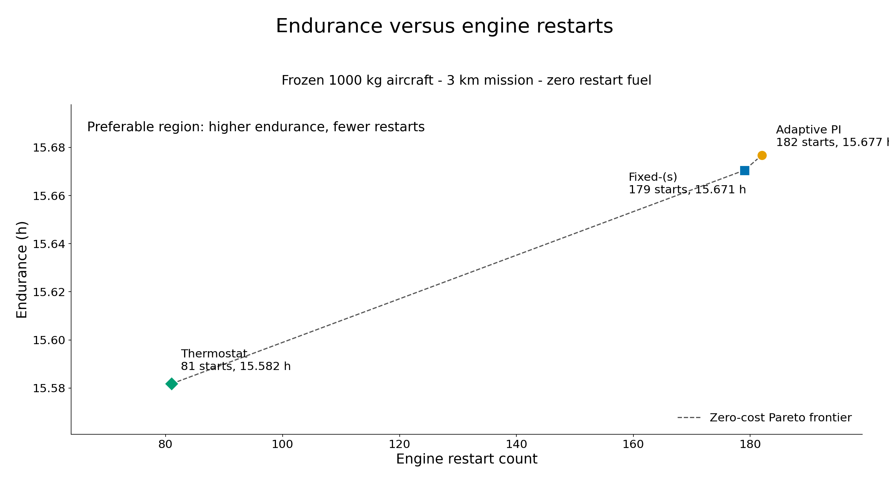

# Authoritative final results

This document is the evidence map for the completed plant–controller search. Unless a section says
otherwise, the headline comparison uses a **3 km mission, 60 s simulation timestep, 60 s physical
minimum ON/OFF dwell, and 0.1 kg of restart fuel per OFF-to-ON transition**.

## 1. Executive result

The project co-designed a series-hybrid fixed-wing UAV plant and its rule-based thermostat
energy-management system. The six variables were wing area, aspect ratio, engine rating, battery
capacity, the lower battery state-of-charge threshold, and the gap to the upper threshold.

One genetic-algorithm (GA) seed found a dynamically feasible design with **54,927.87406455872 s
(15.2577428 h) of loiter**, compared with **48,536.880130153375 s (13.4824667 h)** for the practical
pre-GA reference. Their total mission times were 61,267.87406455872 s and 54,876.880130153375 s,
respectively. The loiter gain was **6,390.993934405342 s (106.516565573 min, 13.1672944723%)**. All
six mission phases completed, and the mission ended normally at the fuel-reserve boundary.

This is the **best feasible design found** within one finite search and one 3 km scenario. It is not
a global optimum or proof of feasibility over the complete 3–10 km altitude band.

## 2. Problem and mission

The problem statement specifies a hybrid-electric fixed-wing unmanned aerial vehicle with a
1000 kg maximum take-off weight (MTOW), 200 kg payload, 250 km/h (69.44 m/s) design cruise speed,
and a 3–10 km cruise-altitude band. The objective is endurance.

The primary optimization scenario fixes cruise and loiter at 3 km and models six mandatory phases:

| Phase | Modelled target |
|---|---|
| Take-off | 120 s at 50 m/s |
| Climb | 0 to 3 km at +2 m/s and 65 m/s airspeed |
| Cruise | 3,600 s at 69.44 m/s |
| Loiter | Minimum-power/stall-margin speed until a resource boundary |
| Descent | 3 km to ground at −3 m/s and 65 m/s airspeed |
| Landing | 120 s at 45 m/s |

The objective is loiter duration, not total time. A candidate must also finish take-off, climb,
cruise, descent, and landing while preserving the post-landing fuel reserve and battery limits.
The 10 km service-ceiling point remains an advisory check under the active interpretation of the
altitude band; this work does not claim complete 3–10 km envelope feasibility.

## 3. Series-hybrid architecture

```text
Fuel → turboshaft → generator/rectifier → DC bus → inverter/motor → propeller
                                             ↕
                                          battery
```

The turboshaft never drives the propeller mechanically. It supplies the direct-current bus through
the generator and rectifier; the electric motor is the only propulsion path. The battery connects
at the bus, discharges to supplement engine-generated power, and absorbs surplus generated power.
In the selected design it acts mainly as an energy and power buffer rather than as the primary
mission-energy source.

Power quantities and signs are defined in [the measurement-point ledger](conventions.md).

## 4. Coupled time-marching model

The model closes aerodynamics, mass, propulsion, energy storage, and controller decisions at each
mission step.

The aerodynamic layer uses a parabolic drag polar,

`C_D = C_D0 + C_L² / (π AR e)`,

then converts drag work and climb work to propeller-shaft power. The optimization path derives
`C_D0` from a reference-calibrated wetted-area buildup instead of making it an independent gene.

The fixed-MTOW mass closure is

`m_fuel = 1000 kg − m_dry`.

Wing, engine, generator, power electronics, motor, cabling/cooling, battery, payload, fixed
equipment, and fuel-system mass therefore compete directly with initial fuel.

The turboshaft uses a Willans-line part-load fuel model, so inefficient low-load operation has a
cost. The battery uses an internal-resistance model,

`P_bus = V_oc I − I²R`,

with positive battery power for discharge and negative power for charge. Its current, energy,
state-of-charge (SoC), and charge/discharge-rate limits are enforced before the next state is
accepted. The simulator then advances fuel, SoC, mass, altitude, controller state, dwell timers,
and phase progress. It shortens boundary steps so resource and phase events occur at their actual
event time.

Feasibility is split into two layers:

- static screening checks mass closure, tank volume, stall speed, point power, engine rating, and
  one-step battery capability before a mission is run;
- dynamic screening checks phase completion, reserves, SoC floor, controller/plant delivery,
  hard dwell, restart accounting, bus balance, fuel accounting, and discrete battery-energy
  closure over the complete mission.

Detailed constants, evidence status, and known bias directions are in
[docs/assumptions.md](assumptions.md).

## 5. Controller evaluation

Equivalent consumption minimization strategy (ECMS) treats battery energy as an equivalent fuel
cost when selecting a power split. Three controller families were compared on the same frozen
reference aircraft:

- fixed-(s) ECMS uses one fixed equivalence-factor ratio;
- adaptive PI-ECMS adjusts that ratio from SoC error with proportional feedback;
- the thermostat is a separate causal, rule-based ON/OFF scheduler with hysteresis and hard dwell.

### Idealized zero-restart comparison

These values use the frozen 1000 kg reference aircraft, 3 km mission, 60 s timestep, and **zero
restart fuel**. They are controller-selection evidence, not GA-aircraft results.

| Controller | Total endurance | Difference from PI | Final SoC | Starts |
|---|---:|---:|---:|---:|
| Adaptive PI-ECMS | 15.6768 h | — | 0.0767 | 182 |
| Fixed-(s) ECMS | 15.6705 h | −22.606 s | 0.0960 | 179 |
| Optimized zero-cost thermostat | 15.5818 h | −342.191 s (−5.703 min) | 0.2204 | 81 |

The fixed and adaptive ECMS variants produced very similar complete-mission results because both
used the same plant, same marginal fuel/energy pricing structure, and nearby locally selected
switching factors. Adaptive PI-ECMS achieved the greatest ideal zero-restart endurance, but that
scenario makes frequent shutdown/restart transitions free.

At an assumed 0.1 kg/start with the zero-cost parameters frozen, the thermostat remained feasible
at 15.0925 h and 77 starts; fixed ECMS remained feasible at 14.6768 h and 161 starts; the adaptive
PI case missed the reserve. A bounded retune selected the practical thermostat band 0.225–0.350,
which produced the 54,876.880 s reference mission with 50 starts. That sensitivity supported the
thermostat as the practical controller for co-design. It did not establish mathematical superiority
over all ECMS formulations.



The exact controller records are in
[controller_zero_restart_comparison.csv](../deliverables/figures/controller_zero_restart_comparison.csv),
[controller_restart_sensitivity.csv](../deliverables/figures/controller_restart_sensitivity.csv),
and [the controller study](controller_comparison.md).

## 6. Thermostat strategy

The thermostat has two SoC thresholds:

- `soc_low`: request engine ON when SoC reaches the lower threshold;
- `soc_high`: permit engine OFF when SoC reaches the upper threshold;
- between the thresholds, retain the current engine state to create hysteresis.

The 60 s minimum ON time and 60 s minimum OFF time are physical scheduling assumptions, not SoC
thresholds and not a second simulation timestep. A state change is blocked until its dwell timer is
satisfied; the controller cannot bypass hard OFF dwell for an early safety restart. If that makes
power delivery impossible, the mission is infeasible.

When ON, the thermostat requests the maximum feasible engine power after current engine,
generator/bus, and battery charge constraints are considered. Surplus bus power charges the
battery. When OFF, the battery serves the bus within its discharge and energy limits. During a
high-demand phase the engine can remain ON while the battery supplies the remaining bus demand.
The simulator—not the scheduler—evaluates the plant, integrates fuel and SoC, and charges restart
fuel once for each actual OFF-to-ON transition.

The thermostat is a rule-based energy-management system. It is not ECMS unless explicitly combined
with Hamiltonian minimization, which the selected path does not do.

## 7. Genetic algorithm

### Chromosome and feasibility path

The chromosome contains six normalized binary64 genes:

| Gene | Physical meaning | Search interval |
|---|---|---:|
| `wing_area` | Wing reference area | 6–16 m² |
| `aspect_ratio` | Wing aspect ratio | 10–24 |
| `engine_rating` | Sea-level turboshaft shaft rating | 60–140 kW |
| `battery_capacity` | Pack energy capacity | 5–30 kWh |
| `thermostat_soc_low` | Lower SoC threshold | Battery floor to 0.60 |
| `thermostat_soc_gap` | Dependent gap to upper threshold | Decodes to at least 0.05 separation and at most 0.95 upper SoC |

The dependent lower-threshold/gap encoding guarantees an ordered threshold pair without repairing
offspring. `C_D0` is derived from geometry, and fuel is the fixed-MTOW residual.

Each candidate first passes the static feasibility screen. Only static-feasible candidates are
built as fresh immutable aircraft/controller inputs and evaluated through one complete mission.
Deb’s constraint rules rank feasible candidates above infeasible candidates, maximize loiter among
feasible candidates, and minimize combined normalized violation among infeasible candidates.
Resource slack, final SoC, and restart count are diagnostics rather than secondary objectives.

### Search settings and execution

| Setting | Value |
|---|---:|
| Population | 64 |
| Evaluated populations | 40 total, including generation zero |
| Tournament size | 3 |
| Crossover | Bounded simulated binary crossover, probability 0.90, `ηc = 15` |
| Mutation | Bounded polynomial mutation, `1/6` per gene, `ηm = 20` |
| Elites | 2 |
| Initialization | 48 Latin-hypercube points plus 16 reference seeds/perturbations |
| Executed seeds | 1 (`20260808`) |

The run ended at the 40-population limit after 2,482 candidate placements and 2,384 unique fitness
evaluations. Static screening rejected 575 results without a mission; 1,809 full missions were run;
198 results were dynamically infeasible; 1,611 were feasible; and 98 placements were exact-cache
hits. Runtime was 2,069.321 s (34 min 29.3 s).

Every new evaluation was appended to a checksummed ledger, while each completed generation updated
an atomic checkpoint containing the population, counters, history, stagnation state, and random
generator state. The runner resumes only when both checkpoint and ledger are present and compatible.

## 8. Reference versus GA-selected design

### 60-second optimization evaluation

Reader-facing values are rounded below. Exact values and complete constraint records are in
[best_found.json](../deliverables/optimization/ga_production_seed_20260808/best_found.json); the
practical reference record is preserved in
[controller_restart_retuning_gate.json](../deliverables/figures/controller_restart_retuning_gate.json).

| Quantity | Practical reference | Best feasible design found |
|---|---:|---:|
| Wing area | 7.591755 m² | 9.022737 m² |
| Aspect ratio | 16.000000 | 22.644481 |
| Span | 11.021256 m | 14.293887 m |
| Derived `C_D0` | 0.028000 | 0.0253693 |
| Engine rating | 86.779137 kW | 83.402060 kW |
| Battery capacity | 10.000000 kWh | 8.343141 kWh |
| Dry mass | 711.389802 kg | 735.607870 kg |
| Initial fuel | 288.610198 kg | 264.392130 kg |
| Thermostat SoC band | 0.225000–0.350000 | 0.208416–0.627422 |
| Loiter duration | 48,536.880 s (13.482 h) | 54,927.874 s (15.258 h) |
| Total mission time | 54,876.880 s (15.244 h) | 61,267.874 s (17.019 h) |
| Final fuel | 5.081139 kg | 7.110844 kg |
| Final / minimum SoC | 0.363668 / 0.178022 | 0.190882 / 0.164957 |
| Restarts | 50 | 25 |
| Restart fuel | 5.0 kg | 2.5 kg |

Both missions used 0.1 kg/start and 60 s physical dwell. The GA evaluation also used a 60 s
integration step.

### 15-second validation

The available dashboard validation artifact replays exactly two frozen designs at 15 s without
rerunning or retuning the GA. Both keep the 0.1 kg/start assumption and 60 s physical dwell.

| Quantity | Practical reference | GA-selected design |
|---|---:|---:|
| Loiter duration | 48,319.560677 s (13.422100 h) | 54,664.956369 s (15.184710 h) |
| Total mission time | 54,659.560677 s (15.183211 h) | 61,004.956369 s (16.945821 h) |
| Final fuel | 5.123558 kg | 7.114786 kg |
| Final / minimum SoC | 0.312034 / 0.212877 | 0.271974 / 0.195764 |
| Restarts | 59 | 27 |

The validated loiter gain was **6,345.3956918535 s (105.756594864 min,
13.1321469049%)**. Both missions completed all six phases and terminated at `fuel_reserve`. This is
a timestep validation of the two selected configurations; it does not replace the 60 s values used
to rank GA candidates. The exact artifact is
[mission_15s_validation.json](../deliverables/validation/mission_15s_validation.json).

## 9. Feasibility and accounting

The best-found 60 s mission passed every hard static and dynamic constraint.

| Check | Quantity | Requirement | Margin / result |
|---|---:|---:|---:|
| Stall speed | 34.3948 m/s | ≤ 37.5 m/s | +3.1052 m/s |
| Cruise engine rating with 10% sizing margin | 83.4021 kW | ≥ 83.3886 kW | +0.0134 kW |
| Climb engine rating with battery assistance | 83.4021 kW | ≥ 72.6914 kW | +10.7106 kW |
| Take-off combined-power rating | 83.4021 kW | ≥ 7.6853 kW | +75.7168 kW |
| One-step battery discharge capability | 25.0294 kW | ≥ 12.7166 kW | +12.3128 kW |
| Fuel tank volume | 328.846 L required | 427.157 L available | +98.311 L |
| Post-landing fuel reserve | 7.110844 kg | ≥ 5.0 kg | +2.110844 kg |
| Battery SoC floor | 0.164957 minimum | ≥ 0.05 | +0.114957 |

The optimized cruise-rating constraint was nearly active. The 10 km service-ceiling advisory was
not: 134.038 kW was required against 83.402 kW installed, a 50.636 kW shortfall. Because that check
is advisory in the explicit 3 km scenario, it did not enter the hard violation sum.

Dynamic audit results were:

- all six phases completed in order;
- termination reason `fuel_reserve`;
- no controller infeasibility, plant infeasibility, hard-dwell violation, hidden restart, or
  terminal failure flag;
- maximum DC-bus residual `9.2371 × 10⁻14 kW`;
- fuel-ledger residual `−3.6948 × 10⁻13 kg`;
- discrete battery-energy residual fraction `0.0`;
- 662 charge-limit encounters and zero discharge-limit encounters.

The charge-limit encounters are active-bound diagnostics, not mission infeasibility. The delivered
power still balanced demand. The separate endpoint battery-energy residual retains the documented
60 s explicit-Euler open-circuit-voltage integration bias; the independently reconstructed
discrete ledger is the hard closure check and closed exactly in the stored result.

## 10. Interpretation

The 13.17% loiter gain came from plant–controller co-design, not from one isolated change.

- Wing area increased by about 18.9%, aspect ratio increased by about 41.5%, and the calibrated
  geometry-derived `C_D0` fell by about 9.4%. Together these change parasite and induced drag at
  loiter while respecting stall and wing-mass constraints.
- Engine rating fell by about 3.9% and battery capacity by about 16.6%, reducing propulsion and
  storage mass relative to larger alternatives. The larger, higher-aspect-ratio wing more than
  offset those savings: dry mass rose by 24.218 kg and initial fuel fell by the same amount under
  fixed-MTOW closure. The endurance gain therefore did not come from simply carrying more fuel.
- The thermostat band widened from 0.125 to 0.419 SoC. This enabled longer ON/OFF cycles, halved
  restarts from 50 to 25, increased the overall engine-OFF fraction from 19.57% to 26.70%, and
  increased the loiter engine-OFF fraction from 21.51% to 28.73%.
- The search reduced engine rating until the 3 km cruise sizing constraint was almost active while
  retaining climb, stall, take-off, battery, reserve, and complete-mission feasibility.

These mechanisms are coupled: changed geometry alters power demand and mass, hardware sizing alters
fuel capacity and feasible power, and thermostat behavior changes where the engine operates on its
part-load fuel curve.

## 11. Limitations

- Only one GA seed was executed. The result does not prove global optimality, and GA
  hyperparameters were not tuned through a multi-seed study.
- The primary mission is at 3 km. The selected aircraft does not satisfy the advisory 10 km
  service-ceiling check, so no full 3–10 km feasibility claim is made.
- Oswald efficiency is fixed at `e = 0.78`; aspect ratio changes induced drag and wing mass, but no
  aspect-ratio-dependent efficiency correlation is active.
- The non-wing wetted area is a provisional calibration that exactly preserves the reference
  `C_D0 = 0.028`; it is inferred rather than measured geometry.
- Restart fuel is an uncalibrated 0.1 kg/start placeholder, and 60 s minimum ON/OFF dwell is an
  engineering assumption.
- The GA evaluated candidates at a 60 s timestep. The 15 s result is a separate replay of the
  selected designs, not a re-optimization.
- The selected aspect ratio is high. The conceptual wing-mass regression does not replace detailed
  structural, aeroelastic, packaging, or manufacturing optimization.
- The model is a conceptual time-marching simulation, not flight or hardware validation. It omits
  detailed computational fluid dynamics, thermal dynamics, ageing, centre-of-gravity motion, and
  transient engine spool behavior.
- Engine Willans calibration, battery resistance/cell data, maximum lift coefficient, usable tank
  fraction, and several component technology assumptions include documented placeholders or
  unverified estimates.
- The restart model omits start energy, spool delay, and engine-life cost.
- Historical dynamic-programming (DP) work is exploratory. Its former unequal-terminal-energy fuel
  bounds and captured-benefit interpretation were withdrawn; it does not establish the benchmark
  optimum used here.
- The cited engineering-source list in the assumptions document still includes pending source
  verification and should not be treated as a completed certification basis.

## 12. Reproducibility and provenance

### Authoritative numerical artifacts

| Evidence | Path |
|---|---|
| Best design, exact mission values, constraints, and run metadata | [best_found.json](../deliverables/optimization/ga_production_seed_20260808/best_found.json) |
| Human-readable run accounting | [ga_run_summary.md](../deliverables/optimization/ga_production_seed_20260808/ga_run_summary.md) |
| Per-population history | [generation_history.csv](../deliverables/optimization/ga_production_seed_20260808/generation_history.csv) |
| Per-evaluation table | [evaluated_candidates.csv](../deliverables/optimization/ga_production_seed_20260808/evaluated_candidates.csv) |
| Checksummed recovery ledger | [evaluation_ledger.jsonl](../deliverables/optimization/ga_production_seed_20260808/evaluation_ledger.jsonl) |
| Atomic GA checkpoint | [ga_checkpoint.json](../deliverables/optimization/ga_production_seed_20260808/ga_checkpoint.json) |
| Practical 0.1 kg/start reference | [controller_restart_retuning_gate.json](../deliverables/figures/controller_restart_retuning_gate.json) |
| Zero-restart controller comparison | [controller_zero_restart_comparison.csv](../deliverables/figures/controller_zero_restart_comparison.csv) |
| Restart sensitivity | [controller_restart_sensitivity.csv](../deliverables/figures/controller_restart_sensitivity.csv) |
| 15-second validation | [mission_15s_validation.json](../deliverables/validation/mission_15s_validation.json) |
| Retained final visuals | [figure manifest](../deliverables/figures/README.md) |
| Assumptions and evidence status | [assumptions.md](assumptions.md) |
| Power and energy conventions | [conventions.md](conventions.md) |
| Exploratory DP correction | [numerical_validity_recovery.md](numerical_validity_recovery.md) |

**Provenance note.** The OPT-04 section of `assumptions.md` retains milestone-era text saying that
no production population had yet run. That statement predates the completed production output
directory. The later `best_found.json`, run summary, generation history, checkpoint, and evaluation
ledger are authoritative for GA execution and results; `assumptions.md` remains authoritative for
the model inputs, evidence status, and limitations.

### Commands

Run from the repository root after installing [the pinned requirements](../requirements.txt).

```bash
# Full tests
python -m pytest tests -q -p no:cacheprovider

# Frozen PI reference regression
python -m pytest tests/test_baseline_regression.py -q -s -p no:cacheprovider

# Named zero-restart thermostat reference
python -m src.analysis.thermostat_mission

# Controller comparison stage with scratch output
python -m src.analysis.controller_comparison zero --output-dir build/controller_comparison

# Dashboard
python -m streamlit run src/dashboard/app.py

# Production GA; resumes compatible checkpoint + ledger state
python -u -m src.optimization.ga_runner
```

The exact opt-in practical reference gate and platform-specific environment-variable syntax are in
[the root README](../README.md#running-the-project). The 15 s validation command and dashboard data
flow are in [the dashboard guide](dashboard.md). The present artifacts are sufficient to inspect
the result; rerunning the GA is unnecessary.

### Verification status for this document

Every reader-facing number above was cross-checked against the linked JSON/CSV artifacts. The
release-cleanup full suite completed on 2026-08-08 with **1,149 passed and 1 skipped** using pytest
9.1.1; bytecode and pytest cache writing were disabled. The cleanup ran no mission, GA, controller
sweep, DP study, or sensitivity study and regenerated no numerical artifact.
